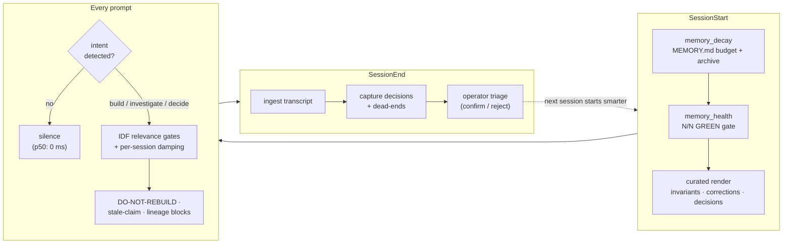
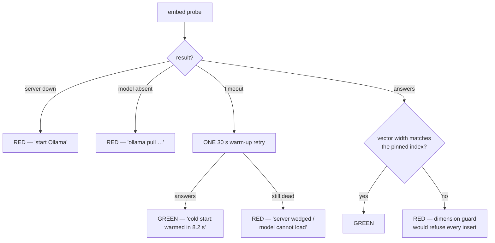

<p align="center">
  
</p>

<p align="center">
  
  
  
  
  
</p>

**A memory and continuity harness for [Claude Code](https://claude.com/claude-code): per-project long-term memory, self-injecting session context, and a health gate that makes silent memory-system death structurally impossible.**

Long-running agentic projects fail in ways that have nothing to do with model quality. Context gets compacted and the thread of a months-long effort snaps. The agent re-proposes a subsystem that already exists. A "helpful" retrieval layer sprays stale context onto every prompt until you learn to skim past it. The memory system itself dies quietly, and nobody notices for a week. Documentation decays while sounding authoritative.

SIx Harness is the working discipline that grew inside a multi-year AI research project — where a single Claude Code session line has run for months across hundreds of compactions — packaged so any project can drop it on. Everything in it exists because one of those failures actually happened, got traced to root cause, and got a structural fix.

<p align="center">
  
</p>

## The session, end to end



---

## What it does

### 1. Per-project long-term memory (`claude-mem`)

A local, private memory core — no cloud services, no API keys; embeddings and synthesis run on your own [Ollama](https://ollama.com).

- **Hybrid retrieval**: BM25 + vector search over one SQLite index (`sqlite-vec`), fused so either leg can carry a query. The vector leg degrades to BM25-only rather than ever blocking a hook.
- **Ingests everything that carries project truth**: docs, memory files, append-only ledgers, past session transcripts, git history — with incremental re-ingest (`claude-mem ingest-incremental`) keeping the index current between sessions.
- **Decision & dead-end capture**: at session end, the capture pipeline extracts candidate decisions and dead-ends from the transcript; you triage them (`claude-mem capture-triage` — confirm / reject / retitle in one batch) so the anti-recurrence record stays curated, not scraped.
- **Corrections extraction**: operator corrections ("no, do it this way") are first-class records, re-surfaced at session start so the same mistake doesn't get made twice.

**No graph database inside** — the index is deliberately plain SQLite; the closest in-harness graph structure is the decision/dead-end → thread lineage links. For structural questions, the harness pairs with an external graph tool — see [Pairing with graphify](#pairing-with-graphify-structural-queries).

### 2. Self-injecting session context

- **SessionStart curated render**: a hard-capped, high-signal block — invariants, recent corrections, recent confirmed decisions, capture-triage debt, and the latest health-gate verdict. Rotation-aware: least-recently-shown corrections surface first, so the same five lines don't greet you forever. A novelty guard hashes the stable content and flags a frozen render across sessions.
- **Prompt-time targeted injection**: when a prompt shows *build*, *investigate*, or *decision* intent, the harness checks the index for existing subsystems ("DO NOT REBUILD" warnings), stale claims, and decision lineage — and injects only what passes IDF-based relevance gates (summed rarity threshold, word-boundary match minimums) plus per-session damping. The design goal is a retrieval layer you never learn to skim: silence on ordinary turns, signal when it fires.
- **System-turn exemption**: agent-completion callbacks and other machine-generated turns get no injection work at all — live telemetry showed such turns attracting topically-matched-but-useless blocks.
- **Memory maintenance**: a SessionStart decay pass keeps the `MEMORY.md` index inside line/byte budgets, archives what falls out, and reports orphaned memory files instead of silently losing them.

### 3. The memory-health gate

One line at every session start:

```
MEMORY-HEALTH: 11/11 GREEN
```

Eleven checks probe the whole stack — ingest watermark freshness, vector coverage, hook heartbeats (did every hook that should have fired actually fire?), capture-queue depth, lineage cache age, memory-file/index integrity, session-render novelty, and an **end-to-end embedding probe** that discriminates its failure modes, each with a matching fix hint:



RED means fix-before-proceeding; the hint tells you how. The design premise: **silence is not success.** A memory system that dies quietly is worse than one that never existed, because you keep trusting it. The complementary rule, learned live: a RED that isn't actionable is alert fatigue — so optional integrations that were never wired report green-with-a-note, cold starts self-warm before verdicting, and misconfigurations (like a fallback embedding model whose vector width can never match the index) are caught at *config* time via model metadata, not at failure time.

### 4. Telemetry-first instrumentation

Every layer writes evidence before it does work:

- `wrapper_invocations` — one row per prompt hook invocation: which intents fired, which blocks were emitted, matched-token IDF, damping, latency. The denominator is always intact, so "how often does this fire and is it ever wrong?" is a query, not a guess.
- `embed_degradation` — log-once records of vector-leg failures, so degraded-to-BM25 periods are visible after the fact.
- `hook_heartbeat` — per-hook success/failure rows; the gate's heartbeat check reads these, which is how a hook that stops firing becomes a RED instead of a mystery.

### 5. Conventions that survive compaction (templates)

The code enforces what it can; the templates carry the discipline that code can't:

- **`MEMORY.md`** — one line per memory, with a `⏯ LATEST` resume anchor read first after every compaction.
- **Invariant files** — a handful of `invariant_*.md` files carrying the project's load-bearing "why", actively re-read at every arc boundary (passively injected context gets skimmed; invariants exist to be re-read).
- **Append-only arc ledger** — one ledger per work arc; append at every decision or verdict, never rewrite; read the tail first on resume.
- **A `CLAUDE.md` constitution template** — transferable absolute rules (trace weak signals to root cause; inventory before inventing; a ground-truth hierarchy that ranks running code over fresh derivations over narrative docs over training knowledge).
- **A `gen_project_state` stub** — the slot for a per-project script that renders *derived-fresh-this-session* facts (flag states, wiring status) so the agent trusts them instead of re-deriving them.

---

## Operational record: the 9-day shakedown

v0.2's fixes come from running this exact stack as the daily driver on the origin project — a large research codebase with a months-long continuous session line — with the telemetry as judge. Numbers from the instrument, 2026-08-19 → 2026-08-28:

| Measure | Result |
|---|---|
| Hook reliability | **2,095 / 2,095 invocations OK** — zero hook failures across 9 days, including a network outage and a multi-day idle gap |
| Injection precision | Pre-harness baseline: stale-claim warnings on **~79%** of intent-bearing prompts (learned-to-skim noise). Post: **3 injections in 9 days, all topically justified, zero false fires** on ordinary turns |
| Retrieval latency | **p50 0 ms** (no-intent prompts do no retrieval work) · p90 2.5 s · inside a 5 s hook budget |
| Health gate | Every RED across the window was a **genuine** degradation (cold server, aged corpus, stale watermark) with a correct fix hint — zero false alarms; the self-heal path verified across a real session boundary |
| Defects found by its own instruments | **2 clusters, both fixed during the shakedown**: a day-one latency stack (IPv6-first localhost resolution vs. an IPv4-only Ollama bind + probe `num_ctx` mismatch forcing model reloads — 11.3 s hook → 1.6 s) and a day-six failure-path chain (structurally-impossible fallback model + cold-start timeout cascade → per-process circuit breaker + config validation) |

The honest summary: it did not run defect-free — it ran **instrumented**, every defect was caught by its own telemetry rather than by vibes, and the fixes are in this release. That loop is the product as much as the code is.

---

## Install

Requirements:

- **Python 3.10+** (Windows, macOS, or Linux; the origin deployment is Windows)
- **[Ollama](https://ollama.com)** running locally, with the embedding model pulled:
  ```
  ollama pull qwen3-embedding:0.6b
  ```
  Optional, for capture synthesis: a small generation model (default `qwen2.5:7b` — configurable in `.claude-mem/config.yaml`).
- **Claude Code** (the harness wires itself into `.claude/settings.local.json` hooks).

Then, from a clone of this repo:

```
git clone https://github.com/mike-m6online/SIx_Harness C:\six-harness
python C:\six-harness\install.py D:\myproject
```

That is the whole flow. The installer:

1. Creates the kit's own virtualenv at `C:\six-harness\.venv` (first run only) and installs the kit into it. The venv is deliberate: the kit ships a `claude_mem` package under the same import name as any pre-existing claude-mem installation on the machine, and hooks bake the venv's absolute executable paths — nothing needs to be on PATH, and no existing installation is disturbed.
2. Runs `harness init` on the project (idempotent merge; details below).
3. Bootstraps the memory index: `claude-mem init` + `claude-mem bulk` (docs + memory + sessions + git; minutes on a large project — `--skip-ingest` to defer).

Re-running is safe end to end: the venv is reused, the merge adds nothing twice, the ingest refreshes. `--dry-run` prints every stage without touching anything.

<details>
<summary>Manual install (the three steps the installer wraps)</summary>

```
python -m venv .venv && .venv\Scripts\pip install -e C:\six-harness
.venv\Scripts\harness init --project-root D:\myproject --claude-mem-exe C:\six-harness\.venv\Scripts\claude-mem.exe
.venv\Scripts\claude-mem init --project-root D:\myproject
.venv\Scripts\claude-mem bulk --project-root D:\myproject
```

The kit also runs uninstalled: `python -X utf8 -m harness init ...` and `python -X utf8 -m claude_mem.cli ...` from the kit root — `harness init` bakes absolute paths, so hooks work regardless.
</details>

### What `harness init` does

1. Creates the Claude Code memory skeleton at `~/.claude/projects/<slug>/memory/` (slug = the absolute project path, lowercased, `:` and separators replaced with `-`: `d:\myproject` → `d--myproject`) and seeds `MEMORY.md` from the template.
2. Creates the append-only arc ledger at `.superpowers/sdd/progress.md`.
3. Seeds `CLAUDE.md` from the constitution template — only if the project has none; an existing `CLAUDE.md` is never touched.
4. **Merges** the hook entries into `.claude/settings.local.json` — every existing setting and hook is preserved, and anything already wired is skipped and reported. Re-runs are idempotent.

Then finish the human part: fill in every `<FILL-IN: ...>` slot in `CLAUDE.md`, write your `PRINCIPLES.yaml`, and author your first `invariant_*.md` files (examples in `templates/memory_file_examples/`).

### The hook wiring it produces

| Event | Hook | Timeout |
|---|---|---|
| SessionStart | `memory_decay.py` (MEMORY.md budget/archive maintenance) | 8 s |
| SessionStart | `memory_health.py` (the N/N GREEN gate) | 8 s |
| SessionStart | `gen_decisions_state.py` (opt-in decisions digest, `--with-decisions`) | 10 s |
| SessionStart | `claude-mem session-start` (curated memory render) | 10 s |
| UserPromptSubmit | `claude-mem prompt-submit` (targeted injection) | 3 s |
| PreToolUse / PostToolUse | `claude-mem tool-use` / `tool-use-post` (activity heartbeats) | 3 s |
| SessionEnd | `claude-mem session-end` + `capture-extract` + `capture-synthesize` (ingest + decision/dead-end capture) | 60–120 s |

All paths are baked absolute, so the hooks depend on neither PATH nor cwd.

---

## Using it day to day

Mostly you don't: the hooks run themselves, and the visible surface is the session-start block, the gate line, and the occasional injected warning. The commands you'll actually type:

```
claude-mem search "have we already built X?"     # hybrid recall, any history question
claude-mem capture-triage                        # review pending decisions/dead-ends
claude-mem capture-triage --apply '[{"id": "...", "verdict": "confirm"}]'
claude-mem ingest-incremental                    # freshen the index mid-session
claude-mem report                                # index / telemetry overview
claude-mem maintenance                           # prune + integrity passes
```

(All take `--project-root`; the wired hooks pass it automatically.) The full CLI is 26 subcommands — `claude-mem --help` — covering ingestion (`init`, `bulk`, `ingest-incremental`, `embed-backfill`), capture (`capture-extract`, `capture-synthesize`, `capture-triage`, `capture-list`, `decision-add`, `decision-confirm`, `dead-end-add`, `thread-add`), corrections (`extract-corrections`), retrieval (`search`), hooks (`session-start`, `prompt-submit`, `tool-use`, `tool-use-post`, `session-end`, `install-hooks`, `heartbeat`), and upkeep (`maintenance`, `report`, `migrate-regrade`, `prune-candidates`).

**When the gate goes RED**: read the line — it names the broken store and the fix. That's the contract: no silent death, no vague alarms.

---

## Pairing with graphify (structural queries)

The memory core answers *history* questions ("have we done X? what did we decide about Y?"). For *structural* questions — "what links to X, what depends on Y, where does Z sit in the dependency graph" — the harness pairs with **[graphify](https://github.com/Graphify-Labs/graphify)**, an external tool that turns a codebase-plus-docs into a queryable knowledge graph. The harness never bundles or invokes it; the integration is a working loop plus one gate check:

**The loop, as run on the origin project:**

1. **Extract** the docs corpus into a versioned out-dir (fully local, via Ollama):
   ```
   graphify extract D:\myproject\docs --backend ollama --model <ctx-pinned-model> \
     --max-concurrency 1 --token-budget 4096 --out C:\graphify_corpora\docs_v1
   ```
   Two settings are load-bearing when a *local* model serves the extraction, both learned the expensive way:
   - **Keep `--token-budget` small** (~4K). Default-sized chunks produce requests a local model cannot answer inside the timeout — a large corpus went 0-for-26 chunks in 10 hours at the default, then 365-for-367 in one evening at 4K.
   - **Pin the model's context length** by creating a derived Ollama model (`FROM <base>` + `PARAMETER num_ctx 16384`). Some serving paths ignore per-request context options, so the base model loads at its full default context, overflows GPU residency, and times out on even small chunks; the pinned variant stays fully GPU-resident.
2. **Verify before trusting**: chunk-failure count in the extract log (healthy runs are <1%), node/edge counts in the same order as the previous corpus, and one live query returning real nodes from real source files.
3. **Query** during work: `graphify query "what depends on the ingest queue?" --graph <out>/graphify-out/graph.json`.
4. **Let the gate watch it**: register the corpus with `--graphify-dir` on the `memory_health` hook, and check 7 goes RED when the newest file ages past 21 days — a stale graph silently answering structural questions is the same failure class as a dead vector leg. Re-extract into a *fresh* out-dir and re-point, so the old graph stays intact until the new one verifies.

Not using graphify? Check 7 reports green with a "not wired" note — an optional integration that was never configured cannot be dead.

---

## Architecture

```
six-harness/
├── claude_mem/        # the memory core: ingestion, hybrid search, capture,
│                      #   hook entry points, telemetry, corrections
├── claude_mem_tests/  # its test suite
├── hooks/             # kit-owned SessionStart scripts: memory_decay.py,
│                      #   memory_health.py (the gate), gen_decisions_state.py,
│                      #   plus optional git_auto_commit.py / process_kill_guard.py
├── hooks_tests/       # their tests
├── harness/           # the `harness` CLI (init = installer/merger)
├── harness_tests/     # its tests
├── templates/         # CLAUDE.md / MEMORY.md / ledger templates, memory-file
│                      #   frontmatter examples, gen_project_state stub
├── assets/            # README art (self-contained SVG)
└── install.py         # one-command installer (venv + init + ingest)
```

`claude_mem` is the engine; `hooks/` are the maintenance/watchdog scripts beside it; `templates/` are the conventions; `harness init` wires all three onto a project without clobbering anything it already has.

### Per-project extension points

- **`gen_project_state`** — copy `templates/gen_project_state_stub.py` into your project, adapt it to parse *your* sources of truth, wire it as an extra SessionStart hook. Its output is tier-2 in the ground-truth hierarchy: derived fresh each session, trusted without re-derivation.
- **`PRINCIPLES.yaml`** — your project's inviolable principles, referenced by the constitution. Keep it small; name the tempting violations.
- **Invariants** — 2–6 `invariant_*.md` files linked from `MEMORY.md`'s `## INVARIANTS` section.
- **The arc ledger** — seeded once; the discipline (append-only, read-the-tail-first) is in the template header.

---

## Tests

```
python -X utf8 -m pytest claude_mem_tests hooks_tests harness_tests -q
```

580 tests, all offline — Ollama is faked at the HTTP layer, so the suite runs anywhere Python does.

## Provenance & license

Extracted from, and still co-evolving with, a long-running AI research project where this stack is the daily driver for a Claude Code session line that has survived months of compactions. Fixes flow from live telemetry there into releases here.

[MIT licensed](LICENSE).
